<div align="center">

<picture>
  <source media="(prefers-color-scheme: dark)" srcset="assets/logo/harbor-lockup-dark.svg">
  
</picture>

### Point it at a simulator. Describe a task. Get a trained policy.

HARBOR turns robot reinforcement learning from an engineering project into a request.<br>
It sets up the environment, writes the task, designs the reward, wires the algorithm,<br>
trains the policy — and checks its own work at every step.

[](https://arxiv.org/abs/2606.08610)
[](https://supersglzc.github.io/harbor-dev)
[](LICENSE)
[](https://claude.com/claude-code)
[](../../actions)

**[Quickstart](#quickstart)** · **[Gallery](#eight-tasks-four-simulators)** · **[How it works](#how-it-works)** · **[Docs](https://supersglzc.github.io/harbor-dev)** · **[Paper](https://arxiv.org/abs/2606.08610)** · **[Cite](#citation)**

<br>

<a href="docs/public/demo.mp4">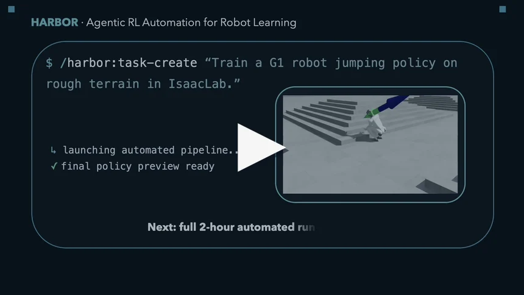</a>

**[▶ Watch the full 3:45 walkthrough](docs/public/demo.mp4)** — one prompt, all six stages, start to trained policy.

</div>

<br>

## What HARBOR is

Reinforcement learning works. The pipeline around it is what costs weeks — building the task, shaping the reward, calibrating randomization, tuning hyperparameters, and re-doing all of it for the next simulator.

HARBOR is a **harness**: a structured execution environment that decomposes that pipeline into bounded stages, hands each to a specialized agent, and refuses to advance until an **executable gate** proves the stage actually worked. Rollouts, reward curves, and rendered video are the evidence. Nothing is taken on the agent's word.

The result is not a black box. Every stage writes inspectable artifacts — code, configs, logs, checkpoints, video — and pauses at a gate you can audit, correct, and resume from.

```
your words ──▶ dependency ──▶ task ──▶ reward ──▶ RL integration ──▶ DR ──▶ training ──▶ policy
                    │          │        │              │             │          │
                    └──────────┴────────┴──────────────┴─────────────┴──────────┘
                                    every arrow is a gate that can fail
```

## Eight tasks, four simulators

The same task descriptions, given to HARBOR against different simulator codebases. It adapts to each one's APIs, asset formats, and contact model while preserving the task and reward intent — and the harness is embodiment-agnostic, so whole-body locomotion goes through exactly the same pipeline as tabletop manipulation.

<table>
<tr>
  <th align="left" width="118">&nbsp;</th>
  <th align="center">IsaacLab</th>
  <th align="center">ManiSkill</th>
  <th align="center">Genesis</th>
  <th align="center">MJLab</th>
</tr>
<tr>
  <td><b>Stack&#8209;Cube</b><br><sub>long-horizon<br>composition</sub></td>
  <td></td>
  <td></td>
  <td>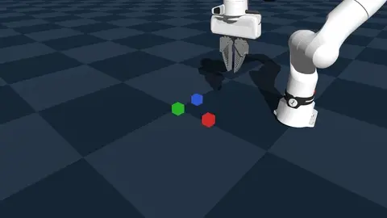</td>
  <td>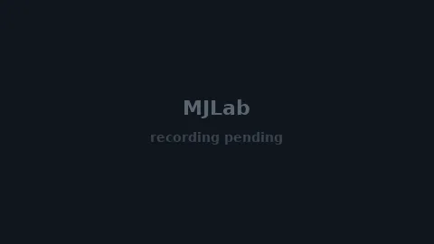</td>
</tr>
<tr>
  <td><b>Insert&#8209;Drawer</b><br><sub>articulated<br>interaction</sub></td>
  <td></td>
  <td>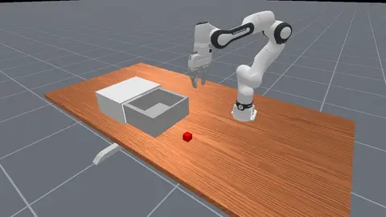</td>
  <td></td>
  <td></td>
</tr>
<tr>
  <td><b>Lift&#8209;Box</b><br><sub>bimanual<br>coordination</sub></td>
  <td>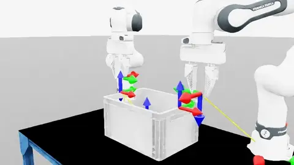</td>
  <td>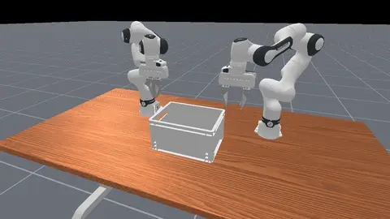</td>
  <td></td>
  <td></td>
</tr>
<tr>
  <td><b>Dex&#8209;Grasp</b><br><sub>dexterous<br>control</sub></td>
  <td>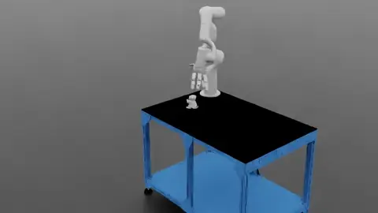</td>
  <td>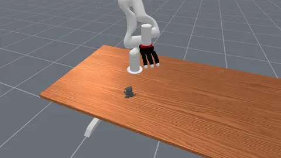</td>
  <td></td>
  <td></td>
</tr>
<tr>
  <td><b>G1&nbsp;Jump</b><br><sub>whole-body<br>dynamics</sub></td>
  <td>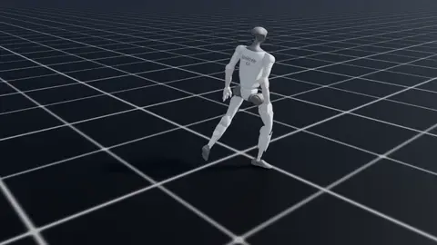</td>
  <td></td>
  <td></td>
  <td></td>
</tr>
<tr>
  <td><b>G1&nbsp;Backflip</b><br><sub>aggressive<br>maneuver</sub></td>
  <td></td>
  <td></td>
  <td>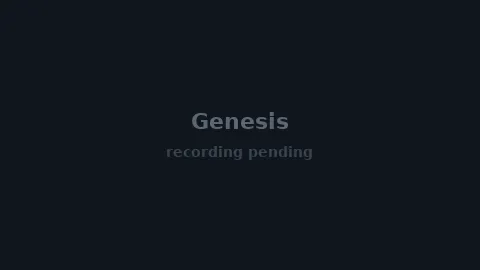</td>
  <td></td>
</tr>
<tr>
  <td><b>G1&nbsp;Footstep</b><br><sub>contact<br>scheduling</sub></td>
  <td></td>
  <td></td>
  <td></td>
  <td></td>
</tr>
<tr>
  <td><b>G1&nbsp;Rough&nbsp;Jump</b><br><sub>uneven<br>terrain</sub></td>
  <td>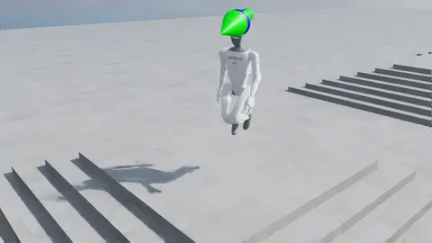</td>
  <td>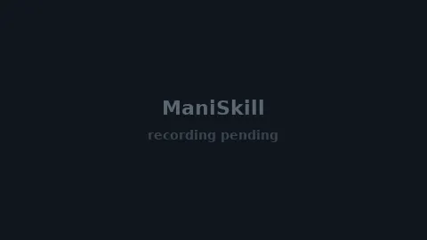</td>
  <td></td>
  <td></td>
</tr>
</table>

<sub>Labelled tiles are runs we have not recorded yet, not runs that failed.</sub>

## Install

HARBOR is a [Claude Code](https://claude.com/claude-code) plugin. It needs one host-side tool — [`uv`](https://docs.astral.sh/uv/) — plus an NVIDIA driver and, if your simulator builds CUDA extensions, the CUDA toolkit.

```bash
curl -LsSf https://astral.sh/uv/install.sh | sh
exec $SHELL
uv --version && nvidia-smi     # both should print
```

Then, inside Claude Code:

```text
/plugin marketplace add supersglzc/harbor-dev
/plugin install harbor@harbor
```

`/harbor:help` lists the full surface. See the [installation guide](https://supersglzc.github.io/harbor-dev/guide/install) for the scripted path and troubleshooting.

## Quickstart

Point HARBOR at any Python GPU robotics repository and describe what you want. It handles the rest.

```text
Set up the env for https://github.com/isaac-sim/IsaacLab, then create a task where
a Franka pushes a 5 cm block to a target marker. Success is block-to-marker
distance under 5 cm.
```

Or drive each stage yourself:

```text
/harbor:env-install-uv                     # probe deps, build .venv/, run the import smoke
/harbor:task-create name=Isaac-Push-Block-Franka-v0 \
    description="Franka pushes a 5 cm wooden block to a target marker; \
                 success when xy distance < 5 cm; horizon 200 steps."
/harbor:rl-run task=Isaac-Push-Block-Franka-v0 algorithm=ppo
/harbor:rl-render checkpoint=harbor/outputs/ppo_Isaac-Push-Block-Franka-v0_.../checkpoint.pt
```

Everything HARBOR generates lands inside the target repository under `harbor/`, so a second benchmark is just the same pipeline run again.

<details>
<summary><b>What a full run produces</b></summary>

```
<your-repo>/
├── .venv/                                  uv-managed environment
└── harbor/
    ├── dependency-generator/               setup_uv.sh, probe.json, install.md
    ├── benchmark-generator/                benchmark-spec.json, benchmark.md, task_overview.md
    ├── rl-integration-generator/           rl-suite-spec.json, rl-integration.md
    ├── create-task/<task>/                 task-history.md, test-checklist.md, smokes/, keyframes
    ├── scripts/rl/<impl>/                  train.py, eval.py, render.py, env_wrapper.py
    ├── configs/rl/                         ppo.yaml, sac.yaml, td3.yaml
    └── outputs/<algo>_<task>_<ts>/         checkpoint, metrics.jsonl, curves/, render.mp4
```

Every one of those files is meant to be read, edited, and re-run by hand.

</details>

## How it works

HARBOR specializes a general agentic harness to robot RL as five interacting pieces:

| | |
|:--|:--|
| **Agents** | Context-isolated subprocesses, each owning one bounded stage. They read stage-local artifacts, do the work, and return a compact summary — implementation noise never reaches the context making decisions. |
| **Commands** | Reproducible operations, from primitives like `rl-run` to composed loops like `reward-tune`. The same surface is callable by any agent, or by you. |
| **Artifacts** | Workflow state externalized into persistent files. They are the communication substrate between agents, which is what lets a run survive a killed agent or a resumed session. |
| **Gates** | Executable checks that decide whether a stage may advance — import checks, rollout shape checks, actuator tracking error, reward-composition assertions, frame-difference render checks. A failed gate returns a diagnosis, not a stack trace. |
| **Knowledge** | Templates, references, and an append-only experience ledger that accumulates across runs, so the second task of a kind is much cheaper than the first. |

The property that matters: HARBOR cannot guarantee your policy is semantically correct. What it does is **turn the common RL engineering failures into gate failures that surface before they propagate downstream** — which is the difference between a bug you find in ten minutes and one you find after a twelve-hour training run.

HARBOR ships **23 commands** and **9 agents**. The full list of each — arguments, roles, tools, and links to the source that defines them — is generated from the plugin itself and lives on the documentation site:

> **[Command reference →](https://supersglzc.github.io/harbor-dev/guide/commands)** &nbsp;·&nbsp; **[Agent reference →](https://supersglzc.github.io/harbor-dev/guide/agents)**

## Documentation

| | |
|:--|:--|
| [Getting started](https://supersglzc.github.io/harbor-dev/guide/) | Install, first benchmark, first task. |
| [Concepts](https://supersglzc.github.io/harbor-dev/guide/harness) | Agents, commands, artifacts, gates, knowledge — and why the harness is shaped this way. |
| [Command reference](https://supersglzc.github.io/harbor-dev/guide/commands) | Every command, generated from the plugin source. |
| [Agent reference](https://supersglzc.github.io/harbor-dev/guide/agents) | Every agent, its tools, and its contract. |
| [Authoring tasks](https://supersglzc.github.io/harbor-dev/guide/tasks) | Create a task, edit one section, or reproduce a task in another simulator. |
| [Tuning rewards](https://supersglzc.github.io/harbor-dev/guide/rewards) | How the candidate search works, and why it trains every candidate for real. |
| [`CLAUDE.md`](CLAUDE.md) | The architecture in full: the six-layer model and where a new module belongs. |

## Citation

```bibtex
@article{li2026harbor,
  title   = {HARBOR: A Harness Framework for Agentic Robot Reinforcement Learning},
  author  = {Li, Zechu and Jin, Yufeng and Liu, Xiaoyang and Liu, Puze and
             Prasad, Vignesh and D'Eramo, Carlo and Chalvatzaki, Georgia},
  journal = {arXiv preprint arXiv:2606.08610},
  year    = {2026}
}
```

## Contributing

Issues and pull requests are welcome — see [CONTRIBUTING.md](CONTRIBUTING.md). The fastest way to help is to run HARBOR on a simulator we have not covered and file what broke: the harness improves by accumulating exactly that kind of experience.

## License

[Apache 2.0](LICENSE). Copyright 2026 The HARBOR Authors.

<div align="center">
<sub>TU Darmstadt · Honda Research Institute Europe · Columbia University · Tongji University<br>
Shanghai Research Institute for Intelligent Autonomous Systems · University of Würzburg · Hessian.AI</sub>
</div>
