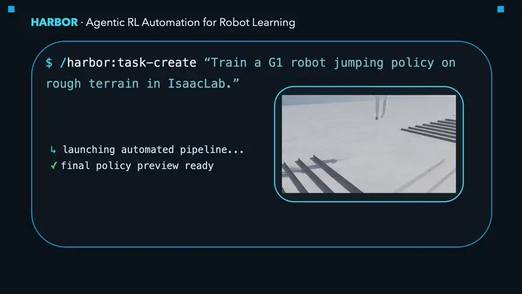
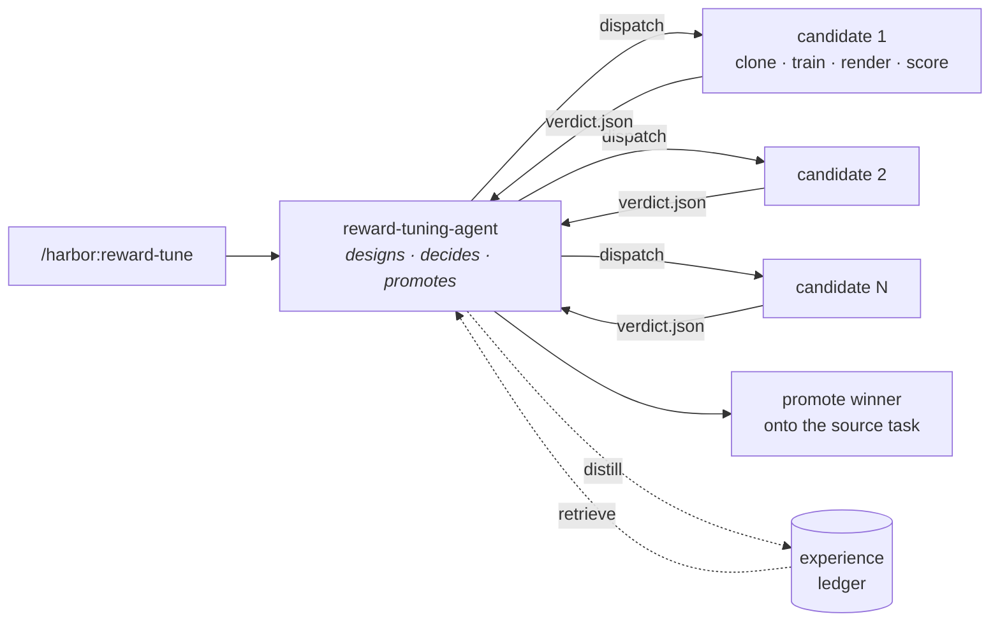
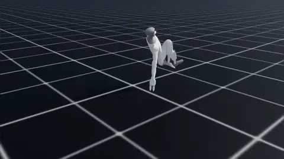

<div align="center">

<picture>
  <source media="(prefers-color-scheme: dark)" srcset="assets/logo/harbor-lockup-dark.svg">
  
</picture>

### Point it at a simulator. Describe a task. Get a trained policy.

HARBOR turns robot reinforcement learning from an engineering project into a request.<br>
It sets up the environment, writes the task, designs the reward, wires the algorithm,<br>
trains the policy — and checks its own work at every step.

[](https://arxiv.org/abs/2606.08610)
[](https://supersglzc.github.io/harbor-dev)
[](LICENSE)
[](https://claude.com/claude-code)
[](../../actions)

**[Quickstart](#quickstart)** · **[Gallery](#one-task-four-simulators)** · **[Results](#results)** · **[How it works](#how-it-works)** · **[Docs](https://supersglzc.github.io/harbor-dev)** · **[Paper](https://arxiv.org/abs/2606.08610)** · **[Cite](#citation)**

<br>



</div>

<br>

## What HARBOR is

Reinforcement learning works. The pipeline around it is what costs weeks — building the task, shaping the reward, calibrating randomization, tuning hyperparameters, and re-doing all of it for the next simulator.

HARBOR is a **harness**: a structured execution environment that decomposes that pipeline into bounded stages, hands each to a specialized agent, and refuses to advance until an **executable gate** proves the stage actually worked. Rollouts, reward curves, and rendered video are the evidence. Nothing is taken on the agent's word.

The result is not a black box. Every stage writes inspectable artifacts — code, configs, logs, checkpoints, video — and pauses at a gate you can audit, correct, and resume from.

```
your words ──▶ dependency ──▶ task ──▶ reward ──▶ RL integration ──▶ DR ──▶ training ──▶ policy
                    │          │        │              │             │          │
                    └──────────┴────────┴──────────────┴─────────────┴──────────┘
                                    every arrow is a gate that can fail
```

## One task, four simulators

The same four task descriptions, given to HARBOR against four different simulator codebases. It adapts to each one's APIs, asset formats, and contact model while preserving the task and reward intent.

<table>
<tr>
  <th align="left" width="110">&nbsp;</th>
  <th align="center">IsaacLab</th>
  <th align="center">ManiSkill</th>
  <th align="center">Genesis</th>
  <th align="center">MJLab</th>
</tr>
<tr>
  <td><b>Stack&#8209;Cube</b><br><sub>long-horizon<br>composition</sub></td>
  <td></td>
  <td></td>
  <td></td>
  <td></td>
</tr>
<tr>
  <td><b>Insert&#8209;Drawer</b><br><sub>articulated<br>interaction</sub></td>
  <td></td>
  <td></td>
  <td></td>
  <td></td>
</tr>
<tr>
  <td><b>Lift&#8209;Box</b><br><sub>bimanual<br>coordination</sub></td>
  <td></td>
  <td></td>
  <td></td>
  <td></td>
</tr>
<tr>
  <td><b>Dex&#8209;Grasp</b><br><sub>dexterous<br>control</sub></td>
  <td></td>
  <td></td>
  <td></td>
  <td></td>
</tr>
</table>

## Results

**End-to-end success rate**, from a task specification to a trained policy, with no human in the loop. Five seeds, 4,096 evaluation rollouts each. `Eureka` and `REvolve` are LLM reward-design baselines given the same backbone, wall-clock budget, and fixed task implementation.

| Task | IsaacLab | Eureka | REvolve | ManiSkill | Genesis | MJLab |
|:--|:--:|:--:|:--:|:--:|:--:|:--:|
| Stack-Cube | **0.885** | 0.000 | 0.000 | **0.936** | **0.935** | 0.221 |
| Insert-Drawer | **0.939** | 0.000 | 0.363 | **0.648** | **0.781** | 0.122 |
| Lift-Box | **1.000** | 0.997 | 0.932 | **1.000** | **0.944** | 1.000 |
| Dex-Grasp | **0.967** | 0.935 | 0.955 | **0.932** | **0.970** | 0.000 |

The two tasks where the baselines collapse to zero are the ones that need staged rewards: HARBOR builds a term ladder where each stage activates only after the previous one completes, while search-from-scratch methods never find the staircase. MJLab is the honest failure case — HARBOR could not find physics parameters yielding stable control there, and we report it rather than dropping the column.

**Reliability and cost.** A clean ManiSkill checkout, Push-Cube, ten repeats per configuration, 50 stage-runs total:

| | Success | Wall-clock | Context | Cost |
|:--|:--:|:--:|:--:|:--:|
| Vanilla agent (no harness) | 29/50 | 185.6 min | 82.8M | $182.15 |
| **HARBOR** | **48/50** | **44.1 min** | **28.1M** | **$70.90** |
| — without parallel isolation | 46/50 | 83.4 min | 65.3M | $130.68 |
| — without gates | 41/50 | 32.9 min | 24.0M | $79.70 |
| — without accumulated experience | 32/50 | 53.5 min | 44.4M | $120.27 |

The full harness is both the most reliable and the cheapest measured configuration. Removing gates makes it *faster*, and lets a silent render-path defect ship — which is the entire argument for gates.

**Other headline numbers:** iteration-heavy stages drop from 49.5 min to 7.9 min (≈6.3×) through parallel isolated trials · accumulated experience cuts a reward redesign from 4 h to 30 min (8×) · autonomous hyperparameter tuning matches or beats hand-tuned defaults in 11 of 12 task settings across IsaacLab, Bi-DexHands, and Loco-MuJoCo.

## Install

HARBOR is a [Claude Code](https://claude.com/claude-code) plugin. It needs one host-side tool — [`uv`](https://docs.astral.sh/uv/) — plus an NVIDIA driver and, if your simulator builds CUDA extensions, the CUDA toolkit.

```bash
curl -LsSf https://astral.sh/uv/install.sh | sh
exec $SHELL
uv --version && nvidia-smi     # both should print
```

Then, inside Claude Code:

```text
/plugin marketplace add supersglzc/harbor-dev
/plugin install harbor@harbor
```

`/harbor:help` lists the full surface. See the [installation guide](https://supersglzc.github.io/harbor-dev/guide/install) for the scripted path and troubleshooting.

## Quickstart

Point HARBOR at any Python GPU robotics repository and describe what you want. It handles the rest.

```text
Set up the env for https://github.com/isaac-sim/IsaacLab, then create a task where
a Franka pushes a 5 cm block to a target marker. Success is block-to-marker
distance under 5 cm.
```

Or drive each stage yourself:

```text
/harbor:env-install-uv                     # probe deps, build .venv/, run the import smoke
/harbor:task-create name=Isaac-Push-Block-Franka-v0 \
    description="Franka pushes a 5 cm wooden block to a target marker; \
                 success when xy distance < 5 cm; horizon 200 steps."
/harbor:rl-run task=Isaac-Push-Block-Franka-v0 algorithm=ppo
/harbor:rl-render checkpoint=harbor/outputs/ppo_Isaac-Push-Block-Franka-v0_.../checkpoint.pt
```

Everything HARBOR generates lands inside the target repository under `harbor/`, so a second benchmark is just the same pipeline run again.

<details>
<summary><b>What a full run produces</b></summary>

```
<your-repo>/
├── .venv/                                  uv-managed environment
└── harbor/
    ├── dependency-generator/               setup_uv.sh, probe.json, install.md
    ├── benchmark-generator/                benchmark-spec.json, benchmark.md, task_overview.md
    ├── rl-integration-generator/           rl-suite-spec.json, rl-integration.md
    ├── create-task/<task>/                 task-history.md, test-checklist.md, smokes/, keyframes
    ├── scripts/rl/<impl>/                  train.py, eval.py, render.py, env_wrapper.py
    ├── configs/rl/                         ppo.yaml, sac.yaml, td3.yaml
    └── outputs/<algo>_<task>_<ts>/         checkpoint, metrics.jsonl, curves/, render.mp4
```

Every one of those files is meant to be read, edited, and re-run by hand.

</details>

## How it works

HARBOR specializes a general agentic harness to robot RL as five interacting pieces:

| | |
|:--|:--|
| **Agents** | Context-isolated subprocesses, each owning one bounded stage. They read stage-local artifacts, do the work, and return a compact summary — implementation noise never reaches the context making decisions. |
| **Commands** | Reproducible operations, from primitives like `rl-run` to composed loops like `reward-tune`. The same surface is callable by any agent, or by you. |
| **Artifacts** | Workflow state externalized into persistent files. They are the communication substrate between agents, which is what lets a run survive a killed agent or a resumed session. |
| **Gates** | Executable checks that decide whether a stage may advance — import checks, rollout shape checks, actuator tracking error, reward-composition assertions, frame-difference render checks. A failed gate returns a diagnosis, not a stack trace. |
| **Knowledge** | Templates, references, and an append-only experience ledger that accumulates across runs, so the second task of a kind is much cheaper than the first. |

The property that matters: HARBOR cannot guarantee your policy is semantically correct. What it does is **turn the common RL engineering failures into gate failures that surface before they propagate downstream** — which is the difference between a bug you find in ten minutes and one you find after a twelve-hour training run.

### Parallel tuning with experience learning

Reward design is a search. HARBOR runs it as centralized control with decentralized execution: a designer agent holds the tuning history and dispatches candidates, each into its own isolated task clone with its own GPU slot. Candidates train asynchronously, score themselves against per-term reward curves and rendered frames, and return a structured verdict. The designer aggregates, decides what to try next, and distills what it learned into experience that later runs retrieve.



This is where most of the cost savings come from: isolated parallel trials cut the iteration-heavy stages by ≈6.3×, and keep the designer's context free of every candidate's tracebacks and log tails.

## Beyond manipulation

The harness is embodiment-agnostic. These are Unitree G1 locomotion policies authored through the same pipeline.

<table>
<tr>
  <td align="center"><br><sub><b>Jump</b></sub></td>
  <td align="center"><br><sub><b>Backflip</b></sub></td>
</tr>
<tr>
  <td align="center"><br><sub><b>Footstep tracking</b></sub></td>
  <td align="center"><br><sub><b>Rough-terrain jump</b></sub></td>
</tr>
</table>

## Command surface

<details>
<summary><b>Environment · task authoring</b></summary>

| Command | Purpose |
|---|---|
| `env-install-uv [path]` | Probe a Python GPU repo, render `setup_uv.sh`, create `.venv/`, run the import smoke. |
| `probe-benchmark [repo=<p>]` | Author the family-level task-authoring guide for a benchmark. |
| `probe-task task=<id>` | Emit a portable per-task spec with verbatim §1–§7 code, for reproducing the task elsewhere. |
| `task-create name=<id> (description=… \| from=<spec>)` | Author a new task, or reproduce one from a spec. Runs §1–§5 authoring → the reward-tune loop → optional DR. |
| `task-list [<id>]` | List or inspect the tasks in the current benchmark. |
| `task-clone op=create source=<id> dest=<id>` | Clone a task into an isolated, independently-editable copy. |

</details>

<details>
<summary><b>Reward engineering</b></summary>

| Command | Purpose |
|---|---|
| `reward-tune task=<id> [pool_size=N] [gpus=N]` | Async-pool reward tuning. Each candidate is a bounded task delta plus a complete reward, trained and scored for real, looping until `success_rate ≥ threshold`, then promoted onto the source task. |
| `reward-add-log` | Wire per-term reward decomposition into a repo without changing its reward, asserting `composer(terms) == reward` every step. |

</details>

<details>
<summary><b>Training · evaluation · tuning</b></summary>

| Command | Purpose |
|---|---|
| `rl-run task=<id> algorithm=<ppo\|sac\|td3>` | Single-trial training with Hydra overrides; auto-renders the final checkpoint. |
| `rl-eval checkpoint=<p>` | Unbiased evaluation; writes `metrics.json` beside the checkpoint. |
| `rl-render checkpoint=<p>` | Render to MP4, with inference-moved and frame-difference sanity checks. |
| `rl-visualize checkpoint=<p>` | Headed GLFW viewer for watching a policy live. |
| `rl-sweep task=<list> algorithm=<list>` | Cartesian-product sweep, one sub-agent per trial, or a SLURM `launch.sh`. |
| `rl-tune task=<list> algorithm=<list>` | Grid hyperparameter tuning; one open-ended tuning agent per cell. |
| `rl-add-trick <trick>` / `rl-list-tricks` | Apply or list RL training tricks (obs RMS, reward normalization, value clipping, …). |

</details>

<details>
<summary><b>Utilities</b></summary>

| Command | Purpose |
|---|---|
| `plot spec=<yaml>` | Multi-panel mean ± std W&B learning curves grouped by task × baseline. |
| `wandb-setup` | Inspect, re-login, or switch the host's W&B account. |
| `update-experience target=<name> …` | Append to an agent's experience ledger, or file a task spec into the task library. |
| `reset-workspace repo=<p>` | Remove all HARBOR output from a repo and restore it to its cloned HEAD. Destructive; gated behind a dry-run and confirmation. |
| `test [layers=1,2,3]` | Plugin test suite: contract + unit layers, plus an end-to-end pipeline on an isolated worktree. |

</details>

<details>
<summary><b>Agents</b></summary>

| Agent | Role |
|---|---|
| `dependency-generator` | Probes dependencies, renders and runs `setup_uv.sh`, verifies imports. |
| `benchmark-generator` | Adds the env-sanity layer: random rollout, render-to-MP4, two-tier smoke, benchmark spec capture. |
| `rl-integration-generator` | Renders the training tree — train/eval/render scripts, configs, algorithm adapter — and smokes each algorithm. |
| `task-generator` | Authors scene, actions, reset, termination, and observation, with a behavioral smoke per section and a recorded rationale for every design choice. |
| `reward-tuning-agent` | Designs reward candidates and decides between them. The only agent that dispatches workers of its own. |
| `reward-candidate-agent` | Carries one candidate end to end: implement, smoke, train, render, score, return a verdict. |
| `task-cloner` | Clones a task's editable surface into a new registered id for collision-free parallel editing. |
| `dr-generator` | Authors domain randomization across robot, object, and observation-noise groups, verified by exact value read-back. |
| `rl-tuning-agent` | Per-cell hyperparameter loop: train → eval → render → analyze → propose. |

</details>

## Documentation

| | |
|:--|:--|
| [Getting started](https://supersglzc.github.io/harbor-dev/guide/) | Install, first benchmark, first task. |
| [Concepts](https://supersglzc.github.io/harbor-dev/concepts/) | Agents, commands, artifacts, gates, knowledge — and why the harness is shaped this way. |
| [Command reference](https://supersglzc.github.io/harbor-dev/reference/commands/) | Every command, generated from the plugin source. |
| [Agent reference](https://supersglzc.github.io/harbor-dev/reference/agents/) | Every agent, its tools, and its contract. |
| [Guides](https://supersglzc.github.io/harbor-dev/guide/author-a-task) | Author a task · tune a reward · tune hyperparameters · port a task across simulators. |
| [`CLAUDE.md`](CLAUDE.md) | The architecture in full: the six-layer model and where a new module belongs. |

## Citation

```bibtex
@article{li2026harbor,
  title   = {HARBOR: A Harness Framework for Agentic Robot Reinforcement Learning},
  author  = {Li, Zechu and Jin, Yufeng and Liu, Xiaoyang and Liu, Puze and
             Prasad, Vignesh and D'Eramo, Carlo and Chalvatzaki, Georgia},
  journal = {arXiv preprint arXiv:2606.08610},
  year    = {2026}
}
```

## Contributing

Issues and pull requests are welcome — see [CONTRIBUTING.md](CONTRIBUTING.md). The fastest way to help is to run HARBOR on a simulator we have not covered and file what broke: the harness improves by accumulating exactly that kind of experience.

## License

[Apache 2.0](LICENSE). Copyright 2026 The HARBOR Authors.

<div align="center">
<sub>TU Darmstadt · Honda Research Institute Europe · Columbia University · Tongji University<br>
Shanghai Research Institute for Intelligent Autonomous Systems · University of Würzburg · Hessian.AI</sub>
</div>
